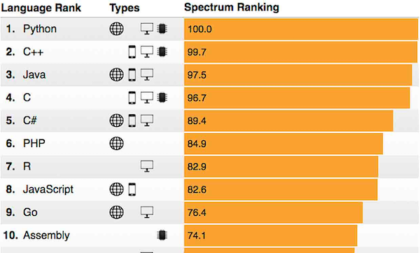

<!-- this is an html comment -->
 This is a comment in Liquid 

## Welcome to the R part of the BCB546 course!

Our goal here is to teach you the basics of R and best practices of using R for data analysis. 
Although we are using the template of the Software Carpentry workshop 
[R for Reproducible Scientific Analysis](http://swcarpentry.github.io/r-novice-gapminder/), most 
lessons are based on the [Bioinformatics Data Skills](http://shop.oreilly.com/product/0636920030157.do) 
book by [Vince Buffalo](https://github.com/vsbuffalo), the [Advanced R](http://adv-r.had.co.nz/) book 
by [Hadley Wickham](http://hadley.nz/), and the [R for Data Science](http://r4ds.had.co.nz/) book by 
[Garrett Grolemund](https://github.com/garrettgman) and [Hadley Wickham](http://hadley.nz/).

### What is R?
- R is a free language and environment for statistical computing and graphics
- R is an interpreted language, not a compiled one, meaning that all commands 
typed on the keyboard are directly executed without requiring to build a complete 
program.
- R has existed for over 30 years
- R is modular — most functionality is from add-on packages.

> ## More technical aspects of R
> As a programming language, R adopts syntax and grammar that differ from 
> many other languages: objects in R are ‘vectors’, and functions are 
> ‘vectorized’ to operate on all elements of the object; R objects have 
> ‘copy-on-modify’ and ‘call-by-value’ semantics; common paradigms in other 
> languages, such as the ‘for’ loop, are encountered less commonly in R.
{: .solution}

## Why R?

## Brief Introduction to R 
#### (from [www.r-project.org](www.r-project.org))

R is a language and environment for statistical computing and graphics. It is similar 
to the S language and environment, which was developed at Bell Laboratories (formerly AT&T, now Lucent Technologies) 
by John Chambers and colleagues. R can be considered as a different (GNU) implementation of S. There are some important 
differences, but much code written for S runs unaltered under R.

R provides a wide variety of statistical and machine-learning methods, and is highly extensible. 
In addition, R is a data programming language that can be used to explore and understand data 
in an open-ended, interactive, and iterative way. 

One of R’s strengths is the ease with which well-designed publication-quality plots can be produced, 
including mathematical symbols and formulae where needed. Great care has been taken over the defaults 
for the minor design choices in graphics, but the user retains full control.

R is available as Free Software under the terms of the Free Software Foundation’s GNU General Public 
License in source code form. It compiles and runs on a wide variety of UNIX platforms and similar 
systems (including FreeBSD and Linux), Windows and MacOS.

Note that in this course we will focus on the subset of the R language that allows you 
to conduct _exploratory data analysis (EDA)_. There are many resources on campus and elsewhere 
to explore the other aspects of R.

> ## Additional resources  
>
> #### Here are some additional resources that we found very useful:  
>
> * The R Project: [https://www.r-project.org/](https://www.r-project.org/)
> * Advanced R (book): [http://adv-r.had.co.nz/](http://adv-r.had.co.nz/)
> * Biocunductor: [http://www.bioconductor.org/](http://www.bioconductor.org/)
> * Cookbook for R: [http://www.cookbook-r.com/](http://www.cookbook-r.com/)
> * R for Data Science (book): [http://r4ds.had.co.nz/](http://r4ds.had.co.nz/)
> * RStudio: [https://www.rstudio.com/](https://www.rstudio.com/)
{: .callout}

